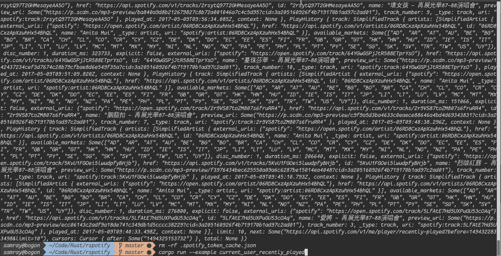

[](https://github.com/ramsayleung/rspotify/actions)
[](https://github.com/ramsayleung/rspotify/blob/master/LICENSE)
[](https://crates.io/crates/rspotify)
[](https://docs.rs/crate/rspotify/)

# Rspotify - a Rust client for The Spotify Web API 

## Disclaimer

This crate is heavily inspired by [spotipy](https://github.com/plamere/spotipy)- A spotify api wrapper implemented in Python

## Description

Rspotify is a lightweight wrapper for the [Spotify Web API](https://developer.spotify.com/web-api/) It includes helper functions for
**all Spotify's endpoints**, such as fetching metadata (search and look-up of albums, artists, tracks, playlists, new releases) and user's information (follow
users, artists and playlists, and saved tracks management).

## Features

*rspotify* supports all of the features of the Spotify Web API including access to all end points, and support for user authorization, notes that before accessing to any end points, you need to be authorized. For details on the capabilities you are encouraged to review the [Spotify Web Endpoint Reference](https://developer.spotify.com/web-api/endpoint-reference/) documentation.

Nowaday, thanks to [`reqwest`](https://docs.rs/reqwest/0.10.1/reqwest/#proxies), `rspotify` now supports system proxy by default. `Reqwest` System proxies look in environment variables to set HTTP or HTTPS proxies. `HTTP_PROXY` or `http_proxy` provide http proxies for http connections while `HTTPS_PROXY` or `https_proxy` provide HTTPS proxies for HTTPS connections.(~~Notes that `reqwest` system proxy doesn't support socks proxy for now,~~ check [this issue](https://github.com/seanmonstar/reqwest/issues/790) for more details)

## Installation

``` shell
cargo install rspotify
```

Or you could get it from [github](https://github.com/samrayleung/rspotify)

## Getting Started

### Authorization

Since all methods require user authorization now, you will need to generate an authorization token that indicates that the user has granted permission for your application to perform the given task.  You will need to register your app to get the credentials necessary to make authorized calls.

Even if your script does not have an accessible URL you need to specify one when registering your application where the spotify authentication API will redirect to after successful login. The URL doesn't need to work or be accessible, you can specify "http://localhost/", after successful login you just need to copy the "http://localhost/?code=..." URL from your browser and paste it to the console where your application is running. For example:


In order to help other developers to get used to `rspotify`, I registerd a Spotify account with temporary email. Your guys could test `rspotify` with this account's `CLIENT_ID` and `CLIENT_SECRET`, check [.env file](./.env) for more details.

### Examples

If you have a use case you are interested in, you could check the
[examples](./examples), which has all kinds of detailed examples. For example,
If you want to get recently played history, you could check
[current_user_recently_played](./examples/current_user_recently_played.rs). This is
the example code:

``` toml
[dependencies]
rspotify = { version = "0.9"}
tokio = { version = "0.2", features = ["full"] }
```

``` rust
extern crate rspotify;

use rspotify::client::Spotify;
use rspotify::oauth2::SpotifyClientCredentials;
use rspotify::senum::Country;

#[tokio::main]
async fn main() {
    // Set client_id and client_secret in .env file or
    // export CLIENT_ID="your client_id"
    // export CLIENT_SECRET="secret"
    let client_credential = SpotifyClientCredentials::default().build();

    // Or set client_id and client_secret explictly
    // let client_credential = SpotifyClientCredentials::default()
    //     .client_id("this-is-my-client-id")
    //     .client_secret("this-is-my-client-secret")
    //     .build();
    let spotify = Spotify::default()
        .client_credentials_manager(client_credential)
        .build();
    let birdy_uri = "spotify:artist:2WX2uTcsvV5OnS0inACecP";
    let tracks = spotify
        .artist_top_tracks(birdy_uri, Country::UnitedStates)
        .await;
    println!("{:?}", tracks.unwrap());
}
```

### Blocking API example
There is an optional "blocking" client API that can be enabled:

``` toml
[dependencies]
rspotify = { version = "0.9", features=["blocking"]}
```

``` rust
extern crate rspotify;

use rspotify::blocking::client::Spotify;
use rspotify::blocking::oauth2::SpotifyClientCredentials;
use rspotify::senum::Country;

fn main() {
    let client_credential = SpotifyClientCredentials::default().build();
    let spotify = Spotify::default()
        .client_credentials_manager(client_credential)
        .build();
    let birdy_uri = "spotify:artist:2WX2uTcsvV5OnS0inACecP";
    let tracks = spotify.artist_top_tracks(birdy_uri, Country::UnitedStates);
    println!("{:?}", tracks.unwrap());
}
```

## Examples

+ Albums:
  - [Get an Album](./examples/album.rs)
  - [Get An Album's Tracks](./examples/album_tracks.rs)
  - [Get several Albums](./examples/albums.rs)
  - [Get current user's saved albums](./examples/current_user_saved_albums.rs)
  - [Add one or more albums to the current user](./examples/current_user_saved_albums_add.rs)
  - [Remove one or more albums from the current user](./examples/current_user_saved_albums_delete.rs)
  - [Check current user's saved album](./examples/current_user_saved_albums_contains.rs)

+ Artists:
  - [Get an Artist](./examples/artist.rs)
  - [Get an Artist's Albums](./examples/artists_albums.rs)
  - [Get an Artist's Top Tracks](./examples/artist_top_tracks.rs)
  - [Get an Artist's Related Artists](./examples/artist_related_artists.rs)
  - [Get Several Artists](./examples/artists.rs)
  - [Get current user's followed artists](./examples/current_user_followed_artists.rs)
  - [Get current user's top artists](./examples/current_user_top_artists.rs)
  - [Current user follow one or more artists](./examples/user_follow_artists.rs)
  - [Current user unfollow one or more artists](./examples/user_unfollow_artists.rs)
  - [Check current user follow artists](./examples/user_artist_check_follow.rs)

+ Browse:
  - [Get a List of Categories](./examples/categories.rs)

+ Track:
  - [Get a Track](./examples/track.rs)
  - [Get several tracks](./examples/tracks.rs)
  - [Get current user's currently playing track](./examples/current_user_playing_track.rs)
  - [Get current user's saved tracks](./examples/current_user_saved_tracks.rs)
  - [Remove current user's saved tracks](./examples/current_user_saved_tracks_delete.rs)
  - [Check current user's saved tracks](./examples/current_user_saved_tracks_contains.rs)
  - [Current user add tracks](./examples/current_user_saved_tracks_add.rs)
  - [Get current user's top tracks](./examples/current_user_top_tracks.rs)
  - [Get current user's recently played tracks](./examples/current_user_recently_played.rs)
  - [Get audio features for a track](./examples/audio_features.rs)
  - [Get audio features for several tracks](./examples/audios_features.rs)
  - [Get audio analysis for a track](./examples/audio_analysis.rs)

+ Player
  - [Get current user's available devices](./examples/device.rs)
  - [Get information about current user's current playback](./examples/current_playback.rs)
  - [Get current user's currently playing track](./examples/current_playing.rs)
  - [Transfer current user's playback](./examples/transfer_playback.rs)
  - [Start/Resume current user’s playback](./examples/start_playback.rs)
  - [Pause current user's playback](./examples/pause_playback.rs)
  - [Skip current user's playback to next track](./examples/next_track.rs)
  - [Skip current user's playback to previous track](./examples/previous_track.rs)
  - [Seek to position in currently playing track](./examples/seek_track.rs)
  - [Set repeat mode on current user's playback](./examples/repeat.rs)
  - [Set volume for current user's playback](./examples/volume.rs)
  - [Toggle shuffle for current user's playback](./examples/shuffle.rs)
  - [Add an item to the end of current user's playback queue](#)

+ Show:
  - [Save shows for current user](./examples/save_shows.rs)
  - [Get a list of saved shows](./examples/save_shows.rs)
  - [Get a show](./examples/get_a_show.rs)
  - [Get seversal shows](./examples/get_several_shows.rs)
  - [Check current user's saved shows](./examples/check_users_saved_shows.rs)
  - [Remove current user's saved shows](./examples/remove_users_saved_shows.rs)

+ Episodes
  - [Get a show's episodes](./examples/get_shows_episodes.rs)
  - [Get an Episode](./examples/get_an_episode.rs)
  - [Get seversal episodes](./examples/get_several_episodes.rs)

+ Search:
  - [Search Item](./examples/search.rs)
  - [Search Artist](./examples/search.rs)
  - [Search Album](./examples/search.rs)
  - [Search Track](./examples/search.rs)
  - [Search Playlist](./examples/search.rs)
  - [Search Show](./examples/search.rs)
  - [Search Episode](./examples/search.rs)

+ User:
  - [Get user's profile](./examples/user.rs)
  - [Get current user's profile](./examples/me.rs)
  - [Current User follow users](./examples/user_follow_users.rs)
  - [Current User unfollow users](./examples/user_unfollow_users.rs)
  

+ Playlist:
  - [Get a Playlist](./examples/playlist.rs)
  - [Get a List of a User's Playlist](./examples/user_playlists.rs)
  - [Get a Playlists's tracks](./examples/user_playlist_tracks.rs)
  - [Creates a playlist for a user](./examples/user_playlist_create.rs)
  - [Change playlist's details](./examples/user_playlist_change_detail.rs)
  - [Unfollowsa playlist for a user](./examples/user_playlist_unfollow.rs)
  - [Adds tracks to a playlist](./examples/user_playlist_add_tracks.rs)
  - [Replace all tracks in a playlist](./examples/user_playlist_replace_tracks.rs)
  - [Reorder tracks in a playlist](./examples/user_playlist_recorder_tracks.rs)
  - [Remove tracks from a playlist](./examples/user_playlist_remove_all_occurrences_of_tracks.rs)
  - [Remove specific tracks from a playlist](./examples/user_playlist_remove_specific_occurrenes_of_tracks)
  - [User follow a playlist](./examples/user_playlist_follow_playlist.rs)
  - [Check user following playlist](./examples/user_playlist_check_follow.rs)
  - [Get a list of Spotify featured playlists](./examples/featured_playlists.rs)

+ Misc
  - [Get list new releases](./examples/new_releases.rs)
  - [Get list categories](./examples/categories.rs)
  - [get recommendtions](./examples/recommendations.rs)

## API Documentation

For more API information, you could check [rspotify Api documentation](https://docs.rs/crate/rspotify)

## CHANGELOG

Please see the [CHANGELOG](./CHANGELOG.md) for a release history.

## Contribution

If you find any problem or have suggestions about this crate, please submit an
issue. Moreover, any pull request ,code review and feedback are welcome.

## License

[MIT](./LICENSE)
