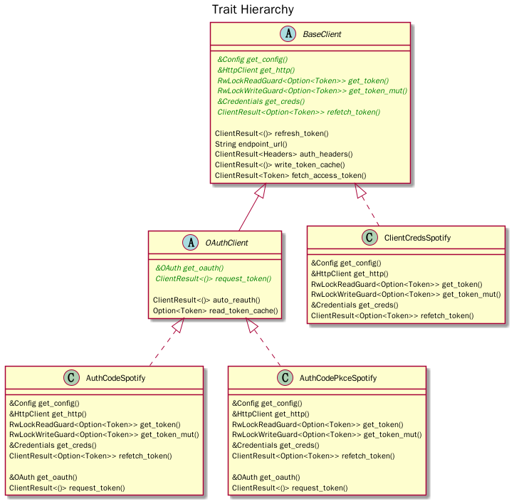
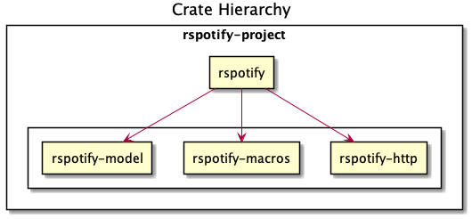

[](https://github.com/ramsayleung/rspotify/actions)
[](https://github.com/ramsayleung/rspotify/blob/master/LICENSE)
[](https://crates.io/crates/rspotify)
[](https://docs.rs/crate/rspotify/)

# RSpotify


RSpotify is a wrapper for the [Spotify Web API](https://developer.spotify.com/documentation/web-api/), inspired by [spotipy](https://github.com/plamere/spotipy). It includes support for all the [authorization flows](https://developer.spotify.com/documentation/general/guides/authorization/), and helper functions for [all endpoints](https://developer.spotify.com/documentation/web-api/reference/).

To learn how to use RSpotify, please refer to the [documentation](https://docs.rs/crate/rspotify/). There are some [examples that may be useful](./examples) as well.

## Changelog

Please see the [changelog](./CHANGELOG.md) for a release history and indications on how to upgrade from one version to another.

## Contributing

If you find any problems or have suggestions about this crate, please submit an issue. Moreover, any pull request, code review and feedback are welcome.

### Code Guide

We use GitHub Actions to make sure the codebase is consistent (`cargo fmt`) and continuously tested (`cargo test`). We try to keep comments at a maximum of 80 characters of length (which isn't automatically checked by `cargo fmt`) and code at 120.

### Trait Hierarchy



### Crate Hierarchy



## Building

RSpotify uses [`maybe_async`](https://docs.rs/maybe-async/0.2.0/maybe_async/) to switch between async and blocking clients, which is triggered inside `Cargo.toml`. So that must be taken into account when building `rspotify`. Read the Configuration section in the docs for more information about how to build with custom TLS implementations, and more.

`client-reqwest` is used by default. It should be as easy as

```sh
$ cargo build
```

`client-ureq` is also available as the `blocking` interface, which compiles RSpotify with [`ureq`](https://docs.rs/ureq/) (a TLS has to be specified as well):

```sh
$ cargo build --no-default-features --features client-ureq,ureq-rustls-tls
```

Notice that you can't build `rspotify` with all features like this:

```sh
$ cargo build --all-features
```

Because in order to switch between clients, the different clients have to implement the same base trait in [src/http/mod.rs](https://github.com/ramsayleung/rspotify/blob/master/src/http/mod.rs), so if you build with all features, you'll get `duplicate definitions` error. As every coin has two sides, you can only have one side at a time, not all sides of it.

## WASM support

RSpotify supports building for the `wasm32-unknown-unknown` target. It should be as easy as:

```sh
$ cargo build --target wasm32-unknown-unknown
```

Refer to the [documentation](https://docs.rs/rspotify/latest/rspotify/#webassembly) for more details

## License

[MIT](./LICENSE)
